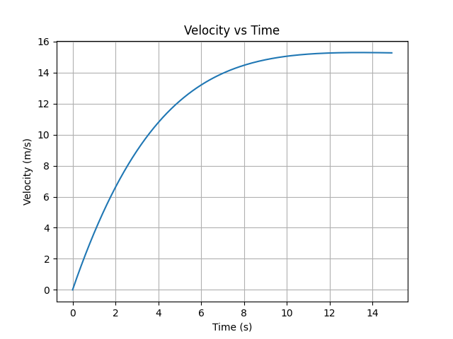
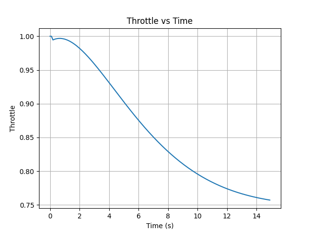

# Vehicle Control Simulation (C++)

## Overview
This project simulates a 1D vehicle model with aerodynamic drag and implements a PI controller to regulate velocity to a target setpoint.

The system demonstrates:
- Vehicle dynamics modelling
- Closed-loop control implementation
- Integral windup handling
- Parameter tuning
- Data logging and response visualisation

## System Architecture
### Vehicle
Physical dynamics (force, drag, acceleration)

### Controller
PI control logic to compute throttle input based on error

### SimulationEngine
Orchestrates simulation loop and integrates the vehicle and controller

### Logger
Handles CSV output for post simulation analysis

## Results
### Velocity Response


### Throttle Response


## Key Observations
- Proportional control alone produced steady-state error due to drag
- Integral action eliminated steady-state error by accumulating persistent velocity error
- Conditional integration was implemented to prevent integral windup during actuator saturation
- Controller gains were tuned to balance overshoot and settling time
- At steady state, throttle converges to equilibrium force required to balance drag

## How to Run
``` 
mkdir build
cd build
cmake ..
make
./vehicle_sim
```

To generate python plots:
``` 
bash
python3 plot.py
```